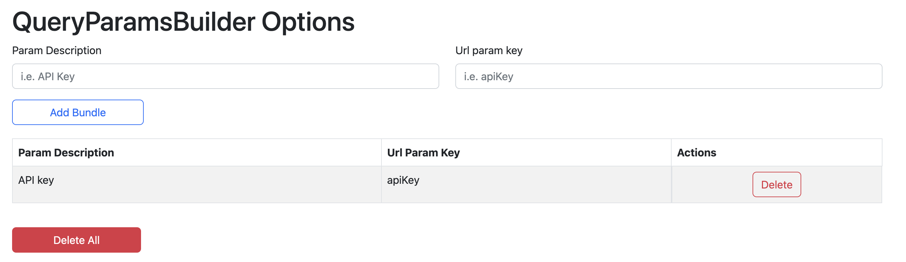
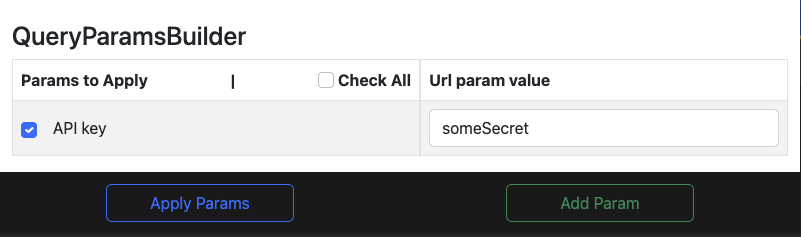
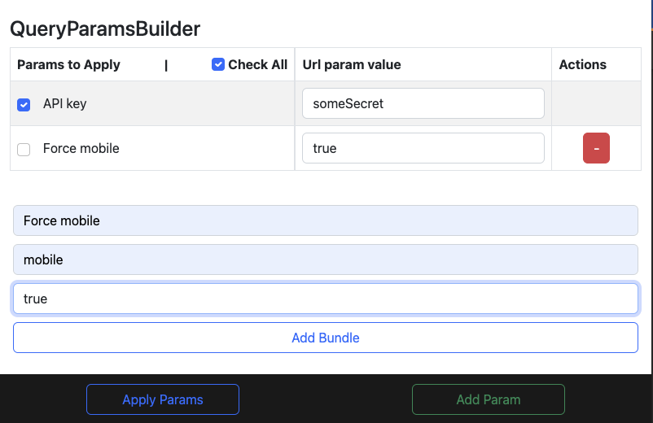

# QueryParamsBuilder

Do you need to check a website providing different url params for testing purposes? Then, this Chrome Extension might come handy to you.

QueryParamsBuilder will allow you to define `key/value` pairs of query params that you can apply to the url for every single browser tab.

The extension consists of two parts.

## 1. Options page

In the options page you will define those params that will be available for all the tabs. In here you will set a description name and the key of the query string param.

All fields are editable and changes are auto-saved once the field loses it's focus.

You can also delete everything from this page.

## 2. Popup page

A popup page will open once you click the extension's button on the browser extension's toolbar. For every single tab you will have by default all the options that you defined in the options page.

You can also define specific params for every single tab.

Once you click the `Apply Params` button, the extension will apply those params that are checked to the url and reload the page.

Note that if you edit or delete a param from the options page it will apply those changes to the popup too. In that case if you have those params applied to any of the tabs you will need to delete them manually.
